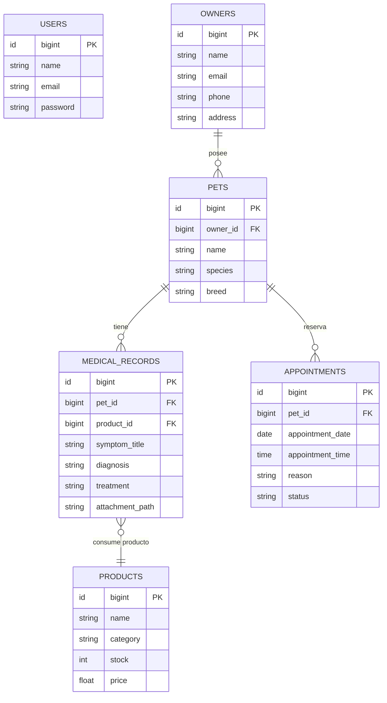

# DOCUMENTO DE SEGUIMIENTO DE PROYECTO
## Desarrollo de Aplicación Web para Clínica Veterinaria

**Ciclo Formativo:** 2º Desarrollo de Aplicaciones Web (DAW)  
**Alumno:** Miguel Martínez  

  

## Índice
1. [Introducción y Planificación](#1-introducci%C3%B3n-y-planificaci%C3%B3n)
2. [Evolución del Proyecto y Nuevos Módulos](#2-evoluci%C3%B3n-del-proyecto-y-nuevos-m%C3%B3dulos)
3. [Diseño de la Base de Datos](#3-dise%C3%B1o-de-la-base-de-datos)
4. [Estado de Desarrollo](#4-estado-de-desarrollo)
5. [Desafíos Técnicos](#5-desaf%C3%ADos-t%C3%A9cnicos)
6. [Repositorio y Acceso al Código](#6-repositorio-y-acceso-al-c%C3%B3digo)
7. [Conclusión](#7-conclusi%C3%B3n)

---

## 1. Introducción y Planificación
Tal y como se planteó en el preproyecto, el objetivo fundamental de esta aplicación es digitalizar la gestión diaria de una clínica veterinaria. El propósito es dejar atrás los sistemas físicos, como las agendas de papel y archivadores, para centralizar toda la información de manera eficiente. Esto evitará la pérdida de historiales clínicos y mejorará sustancialmente el seguimiento médico de los pacientes (mascotas).

Para la ejecución técnica, he optado por consolidar un enfoque moderno basado en un **modelo desacoplado**, que se alinea con los estándares de desarrollo profesional actuales:
- **Backend (API RESTful):** Desarrollado con el framework de PHP, **Laravel**, para gestionar de forma robusta y segura toda la lógica de negocio y persistencia de datos.
- **Frontend (Single Page Application):** Construido mediante la librería **React**, consumiendo los endpoints de la API para crear una experiencia de usuario (UX) rica, interactiva y sin recargas de página. La interfaz gráfica se ha apoyado en el framework **Tailwind CSS**, garantizando un diseño visualmente atractivo, coherente y plenamente responsive.

## 2. Evolución del Proyecto y Nuevos Módulos
Durante el curso del desarrollo la hoja de ruta inicial no solo se ha mantenido, sino que **se han completado con éxito módulos funcionales muy ambiciosos**, logrando integrar características avanzadas en el ecosistema de la aplicación:

* **Separación Administrativa (Users y Owners):** Se decidió separar al personal con acceso al sistema (`Users`) de los dueños o clientes formales de la clínica (`Owners`) para mantener una base de datos más limpia y separar perfiles de autenticación frente a datos de facturación.
* **Módulo de Historial Clínico Completo:** He integrado con éxito un módulo avanzado que permite gestionar los síntomas, diagnósticos y tratamientos de cada mascota, permitiendo además la subida y almacenamiento de archivos adjuntos (como analíticas en imagen o justificantes en PDF).
* **Inventario Dinámico:** Se ha creado un control de *Dashboard de Inventario* que gestiona el stock de medicamentos y consumibles (`Products`), los cuales además se han enlazado con el Historial Médico de manera que se puede registrar qué material se ha gastado en cada consulta.
* **Gestión de Calendario en Tiempo Real:** Se ha desarrollado una vista interactiva de agenda (*DashboardCalendar*) que permite la gestión ágil del estado de las citas en `React`.

## 3. Diseño de la Base de Datos
La persistencia de datos está gestionada mediante un sistema gestor de bases de datos relacionales interactuando con **MySQL**, garantizando la integridad referencial de los historiales médicos.

El diagrama **Modelo Entidad-Relación (MER)** ha evolucionado considerablemente para soportar los nuevos módulos desarrollados:

## 4. Estado de Desarrollo
El proyecto ha experimentado un fuerte impulso técnico y visual. Actualmente el grado de avance global de la aplicación se sitúa en torno al **70% - 80%**.

* **Logros Alcanzados Recientemente:** 
  - La arquitectura Front-Back está perfeccionada mediante Axios.
  - Finalizado el sistema completo de Historiales Clínicos (con soporte para *uploads* multipart de archivos PDF e imágenes).
  - Componente de Calendario programado, interactivo y comunicado con el Backend.
  - Incorporado el módulo extra de Inventario (Gestión de Productos).
* **Foco Actual:** Me encuentro refinando la vinculación visual mediante modales interactivos para asegurar una buena UX/UI sin necesidad de saltos constantes de página.
* **Siguientes Hitos:** Una vez dominados y pulimentados los flujos actuales, procederé a abordar el motor de generación en lote de facturas en PDF, y a preparar el entorno final para el despliegue automático del proyecto en producción.

## 5. Desafíos Técnicos
La construcción ambiciosa de estos módulos con un stack altamente demandado presenta una serie de retos superados con éxito:

* **Subida y Servido de Archivos (MIME Types):** Gestionar datos de formulario multipart desde React hacia Laravel para subir archivos PDF o imágenes al servidor, validar su extensión y luego servirlos de vuelta como recurso visual, ha sido uno de los problemas de backend más complejos solventados en esta etapa.
* **Complejidad de Interfaz en React:** Proveer una experiencia centralizada demandó encapsular el comportamiento en componentes y aislar fuertemente los estados (por ejemplo al manejar formularios complejos como el de productos o el de diagnóstico). Se solucionó incorporando librerías de alertas (SweetAlert2) y trabajando la propagación de re-renderizados.
* **CORS y Configuración Base:** Los problemas iniciales de Cross-Origin Resource Sharing y la configuración de puertos entre Vite y XAMPP se han solucionado creando una política estable que ahora responde sin fisuras.

## 6. Repositorio y Acceso al Código
El control de versiones del código fuente se encuentra alojado a través de **GitHub** en mi repositorio privado: `Miguelmntz/Veterinarian`.

Reconociendo el uso de repositorios en modalidad privada por motivos de seguridad mientras desarrollo, **he habilitado ya a su cuenta de usuario** los permisos de visualización del código base, de acuerdo a la retroalimentación recibida. De esta forma podrá evaluar sin impedimentos técnicos los progresos sobre los Controladores en PHP y los nuevos Componentes de React que acabo de detallar.

## 7. Conclusión
El desarrollo ha tomado una senda de gran madurez. Abordar el historial clínico acoplado al control de consumibles e implementar el calendario directamente desde cero está logrando acercar la aplicación hacia un producto que podría ser fácilmente desplegado y utilizado por una clínica real. El avance demuestra las capacidades de construir la lógica transaccional requerida para un entorno profesional e interactivo.
